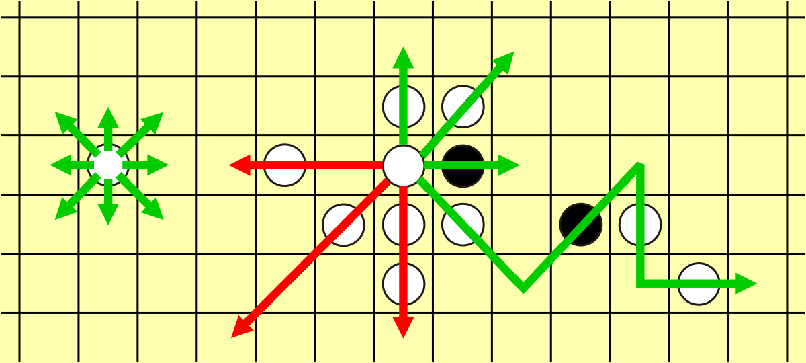
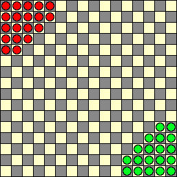

#  Halma AI

## Synopsis

This project was completed as a part of my coursework for the course CSCI 561: Foundations in Artificial Intelligence at the University of Southern California, Fall 2019 under Prof. Itti.

## Description
In this project, we will play the game of Halma, an adversarial game with some similarities to checkers. The game uses a 16x16 checkered gameboard. Each player starts with 19 game pieces clustered in diagonally opposite corners of the board. To win the game, a player needs to transfer all of their pieces from their starting corner to the opposite corner, into the positions that were initially occupied by the opponent. Note that this original rule of the game is subject to spoiling, as a player may choose to not move some pieces at all, thereby preventing the opponent from occupying those locations. Note that the spoiling player cannot win either (because some pieces remain in their original corner and thus cannot be used to occupy all positions in the opposite corner). Here, to prevent spoiling, we modify the goal of the game to be to occupy all of the opponent’s starting positions which the opponent is not still occupying.

## Repository Structure

* **hw2-csci561-f19.pdf** : contains the assignment description, including the description, and the input and output format specification.
* **halma.py** : main python code that contains the solution for the assignment
* **hw2-addendum.pdf** : non spoiling rules for the game

## Class Tournament

The final project for this course was structured around creating this
 AI agent so that the student's bots in class could compete with each other and one with the TA's bot in one final tournament
on the last day of class.

## Motivation
Simply run by `g++ -o obj halma.cpp` and  `./obj` typing and make sure to cross check the input files.

## Game Images

    
    
  

## Additional Notes

* The move-finding method is under the assumption that pieces cannot re-enter
friendly goals or leave enemy goals even during a jump chain.
* Computation is currently fixed to a ply-depth of 3 rather than using
dynamic depth.
* Turn time exhaustion will simply break the recursion with its current max.

